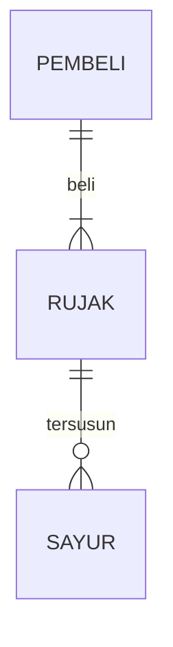

## 1.1 Latar Belakang
MEMBUAT SEBUAH APKLIKASI KEDAI KOPI DENGAN MENGGUNAKAN HTML,CSS & JAVA SCRIPT

Fauzi Abdul Malik,17 Oktober 2023

## 1.2. Deksripsi Teknologi Informasi

Melalui artikel ini kita dapat mengetahui bagaimana sebuah teknologi informasi yang berbasis client-server ini dibuat melalui sebuah website sederhana, dengan tujuan pembelian secara digital. Dengan adanya website ini kita dapat memudahkan pemesanan tanpa adanya suatu antrian.

## 1.3. Branding

pada tahapan brending kali ini saya membuat brending meliputi:
> merk : Kopi Rumahan

> Tagline : Dengan meminum kopi Rumahan kita akan mendapatkan manfaat untuk tubuh yaitu dapat meningkatkan fokus dan  kewaspadan , meningkatkan daya ingat, dan masih banyak yang lainnya.

> target-user:
 - usia 13+
 - Seseorang yang senang meminum kopi(penikmat kopi)
 - seseorang yang senang Nongkrong
   
## 2. User Story

Sebagai  | saya ingin            | sehingga                                | prioritas
Pengguna | pengiriman cepat      | kopi yang saya pesan masih hangat       |⭐⭐⭐⭐⭐
pengguna | Kemasan yang kualitas | sehingga kopi tetap terjaga dengan baik | ⭐⭐⭐⭐⭐
Pengguna | Pembayaran            | dapat membayar secara e-money atau COD  | ⭐⭐⭐⭐

## 3. Struktur Data

Cara membuat aneka macam bentuk grafik menggunakan mermaid.js bisa lihat di [https://mermaid.js.org/syntax/entityRelationshipDiagram.html](https://mermaid.js.org/syntax/entityRelationshipDiagram.html) 

## 4. Arsitektur Sistem

Masih pake mermaid.js juga bisa lihat flowchart di [https://mermaid.js.org/syntax/flowchart.html](https://mermaid.js.org/syntax/flowchart.html)

## 5. Teknologi, Library, dan Framework

bla bla bla

## 6. Desain User Experience dan User Interface

Bisa load image 

## 7. Demonstrasi Video

Link youtube nya

## 8. Bagaimana mesin komputasi dan sistem operasi berperan dalam produk teknologi informasimu ?

Link youtube nya di detik jawaban ini

## 9. Bagaimana algoritma, struktur data, dan bahasa pemrograman berperan dalam produk teknologi informasimu ?

Link youtube nya di detik jawaban ini

## 10. Bagaimana metode pengembangan perangkat lunak / Software Development Life Cycle berperan dalam produk teknologi informasimu ?

Link youtube nya di detik jawaban ini

## 11. Bagaimana database / sistem basis data berperan dalam produk teknologi informasimu ?

Link youtube nya di detik jawaban ini
