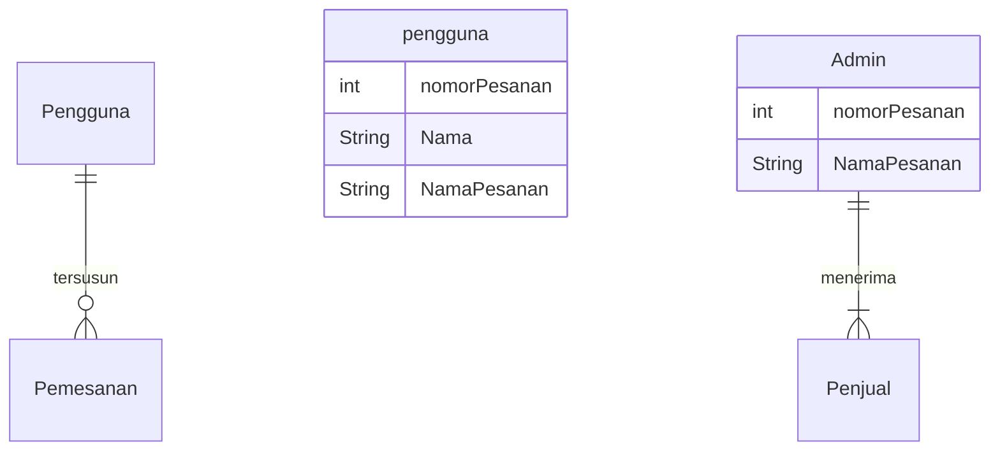

## 1.1 Latar Belakang
Melalui artikel ini kita dapat mengetahui bagaimana sebuah teknologi informasi yang berbasis client-server ini dibuat melalui sebuah website sederhana, dengan tujuan pembelian secara digital. Dengan adanya website ini kita dapat memudahkan pemesanan tanpa adanya suatu antrian.

Di buatnya website ini adalah  untuk menimalisir penjualan bisnis kedai kopi karena semakin perkembangan zaman sistem informasi semakin banyak digunakan, oleh karena itu dibuatlah website kedai kopi untuk memudahkan para penjual dan pembeli. 

Dan berbelanja dengan sistem online ini sudah di nikmati oleh hampir semua orang di seluruh dunia ,dengan sistem informasi yang semakin kesini semakin berkembang kita sebagai manusia pasti mengikuti perkembangan zaman yang dimana sistem informasi dan teknologi sangat cepat perkembangannya.     

## 1.2. Deksripsi Teknologi Informasi

 Saya menggunakan MySQL untuk databasenya dan menggunakan visual Studio code untuk membuat program yang saya buat dan menggunakan HTML,CSS sebagai library dan Javascript sebagai fremeworknya  juga saya menggunakan Figma untuk mendesain rancangan aplikasi yang saya buat. 

## 1.3. Branding

pada tahapan brending kali ini saya membuat brending meliputi:

- Merk: Kopi Rumahan 
- Tagline: "Kopi Berkualitas"
- Campaign:  Dengan meminum kopi Rumahan kita akan mendapatkan manfaat untuk tubuh yaitu dapat meningkatkan fokus dan  kewaspadaan , meningkatkan daya ingat, dan masih banyak yang lainnya.
- Target user:
    - Usia 13+
    - Seorang yang senang dengan KOPI
    - Seorang yang Penikmat kopi
    - Seorang Pekerja 
    - Seorang Pelajar 
- User experience theme:
  - Sederhana
  - Pemesanan mudah
  - Profesionalisme
  - warna: warna coklat dan Hitam yang memberikan suasana hangat saat meminum kopi dikarenakan sesuai dengan warna kopi
  - Inspirasi desain :
  - 

## 2. User Story

sebagai | saya ingin bisa | sehingga | Prioritas
---|---|---|---
pengguna | melihat daftar menu  | bisa memilih produk yang tersedia di toko | ⭐⭐⭐⭐⭐
pengguna | mencari daftar menu | bisa memudahkan saya dalam menemukan menu yang sedang dicari | ⭐⭐⭐⭐⭐
pengguna | memasukan alamat | bisa  menentukan alamat pengiriman paket  | ⭐⭐⭐⭐⭐
pengguna | pengiriman Cepat | agar Kopi tetap hangat saat di minum | ⭐⭐⭐⭐⭐
pengguna | Melihat ringkasan pemesanan | agar dapat mengecek pesanan sebelum di konfirmasi| ⭐⭐⭐⭐

## 3. Struktur Data

Cara membuat aneka macam bentuk grafik menggunakan mermaid.js bisa lihat di [https://mermaid.js.org/syntax/entityRelationshipDiagram.html](https://mermaid.js.org/syntax/entityRelationshipDiagram.html) 

## 4. Arsitektur Sistem

Masih pake mermaid.js juga bisa lihat flowchart di [https://mermaid.js.org/syntax/flowchart.html](https://mermaid.js.org/syntax/flowchart.html)

## 5. Teknologi, Library, dan Framework

bla bla bla

## 6. Desain User Experience dan User Interface
- tampilan home awal desktop
  
- ketika di klik searching
  
- ketika di Klik About
  
- ketika di Klik Menu
  
- ketika di Klik Contact
- tampilan Handphone
  

## 7. Demonstrasi Video

Link youtube nya

## 8. Bagaimana mesin komputasi dan sistem operasi berperan dalam produk teknologi informasimu ?

Link youtube nya di detik jawaban ini

## 9. Bagaimana algoritma, struktur data, dan bahasa pemrograman berperan dalam produk teknologi informasimu ?

Link youtube nya di detik jawaban ini

## 10. Bagaimana metode pengembangan perangkat lunak / Software Development Life Cycle berperan dalam produk teknologi informasimu ?

Link youtube nya di detik jawaban ini

## 11. Bagaimana database / sistem basis data berperan dalam produk teknologi informasimu ?

Link youtube nya di detik jawaban ini
