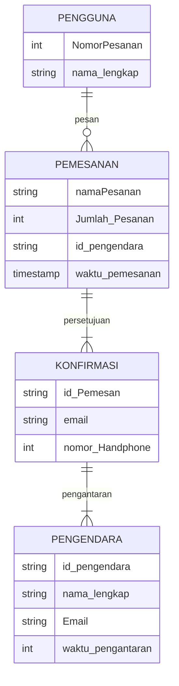
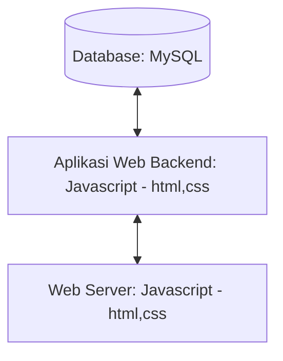

## 1.1 Latar Belakang

kedai kopi adalah tempat yang sangat diminati anak muda zaman sekarang dimana kedai kopi ini memiliki tempat yang sangat cocok untuk nongkrong, mengerjakan tugas, bersantai dan juga untuk acara bersama keluarga oleh karena banyak sekali orang yang mendirikan sebuah kedai kopi di berbagai tempat. Nah oleh karena itu supaya kedai kopi ini mudah di kenal oleh berbagai kalangan masyarakat baik masyarakat yang dekat maupun masyarakat yang jauh maka dari itu di buatlah sebuah website yang bertujuan untuk menimalisir penjualan bisnis kedai kopi ini karena semakin kesini perkembangan zaman semakin pesat dan  sistem informasi semakin banyak digunakan, oleh karena itu dibuatlah website kedai kopi untuk memudahkan para penjual dan pembeli agar dapat berbelanja dengan sistem online dan sistem online ini sudah banyak di nikmati oleh hampir semua orang di seluruh dunia ,dengan sistem informasi yang semakin kesini semakin berkembang kita sebagai manusia pasti mengikuti perkembangan zaman yang dimana sistem informasi dan teknologi sangat cepat perkembangannya. Dan kedai yang saya buat berjudul Kedai KOPI RUMAHAN adalah sebuah kedai kopi yang dapat digunakan oleh wirausahawan yang mebuat bisnis kedai kopi di rumahnya sendiri dan website ini juga dibuat agar bisa menjadikan peluang pekerjaan bagi orang yang ingin membuat bisnis di rumahnya.

## 1.2. Deksripsi Teknologi Informasi

 Saya menggunakan MySQL untuk databasenya dan menggunakan visual Studio Code untuk membuat program yang saya buat dan menggunakan HTML,CSS sebagai library dan Javascript sebagai Fremeworknya juga saya menggunakan Figma untuk mendesain rancangan aplikasi yang saya buat. 

## 1.3. Branding

pada tahapan brending kali ini saya membuat brending meliputi:

- Merk: Kopi Rumahan 
- Tagline: "Kopi Berkualitas"
- Campaign:  Dengan meminum kopi Rumahan kita akan mendapatkan manfaat untuk tubuh yaitu dapat meningkatkan fokus dan  kewaspadaan , meningkatkan daya ingat, dan masih banyak yang lainnya.
- Target user:
    - Usia 13+
    - Seorang yang senang dengan KOPI
    - Seorang yang Penikmat kopi
    - Seorang Pekerja 
    - Seorang Pelajar 
- User experience theme:
  - Sederhana
  - Pemesanan mudah
  - Profesionalisme
  - warna: warna coklat dan Hitam yang memberikan suasana hangat saat meminum kopi dikarenakan sesuai dengan warna kopi
  - Inspirasi desain :
  - 

## 2. User Story

sebagai | saya ingin bisa | sehingga | Prioritas
---|---|---|---
pengguna | melihat daftar menu  | bisa memilih produk yang tersedia di toko | ⭐⭐⭐⭐⭐
pengguna | mencari daftar menu | bisa memudahkan saya dalam menemukan menu yang sedang dicari | ⭐⭐⭐⭐⭐
pengguna | memasukan alamat | bisa  menentukan alamat pengiriman kopi | ⭐⭐⭐⭐⭐
pengguna | pengiriman Cepat | agar Kopi tetap hangat saat di minum | ⭐⭐⭐⭐
pengguna | Melihat ringkasan pemesanan | agar dapat mengecek pesanan sebelum di konfirmasi| ⭐⭐⭐⭐
pengguna | memberikan nilai kopi | agar kualitas kedai kopi dapat di tingkatkan | ⭐⭐⭐⭐
pengguna | memberikan kometar | agar dapat memberikan saran kepada kedai kopi |⭐⭐⭐⭐
pengguna | melihat harga | mengetahui harga pesanan kopi | ⭐⭐⭐⭐⭐
pengguna | memilih nomor meja | untuk membooking meja apabila ingin minum kopi di tempat dan memudahkan pelayan mengantarkan pesanan | ⭐⭐⭐⭐⭐
## 3. Struktur Data

Cara membuat aneka macam bentuk grafik menggunakan mermaid.js bisa lihat di [https://mermaid.js.org/syntax/entityRelationshipDiagram.html](https://mermaid.js.org/syntax/entityRelationshipDiagram.html) 

## 4. Arsitektur Sistem

## 5. Teknologi, Library, dan Framework

Saya membuat website ini menggunakan teknologi visual Studio Code dan library yang digunakan adalah Hmtl,css dan javaScript sedangkan Framework saya menggunakan Css dan JavaScript 

## 6. Desain User Experience dan User Interface

- tampilan home awal desktop
  
  
- ketika di klik searching
  
- ketika di Klik About
  
- ketika di Klik Menu
  
- ketika di Klik Contact

- tampilan Handphone

  

## 7. Demonstrasi Video

Link youtube nya

## 8. Bagaimana mesin komputasi dan sistem operasi berperan dalam produk teknologi informasimu ?

Link youtube nya di detik jawaban ini

## 9. Bagaimana algoritma, struktur data, dan bahasa pemrograman berperan dalam produk teknologi informasimu ?

Link youtube nya di detik jawaban ini

## 10. Bagaimana metode pengembangan perangkat lunak / Software Development Life Cycle berperan dalam produk teknologi informasimu ?

Link youtube nya di detik jawaban ini

## 11. Bagaimana database / sistem basis data berperan dalam produk teknologi informasimu ?

Link youtube nya di detik jawaban ini
